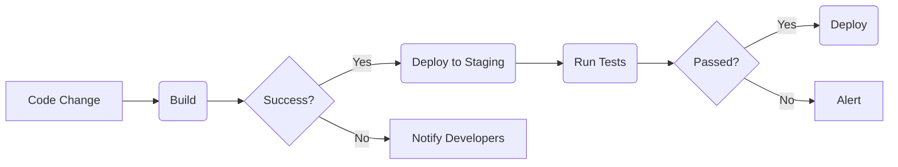
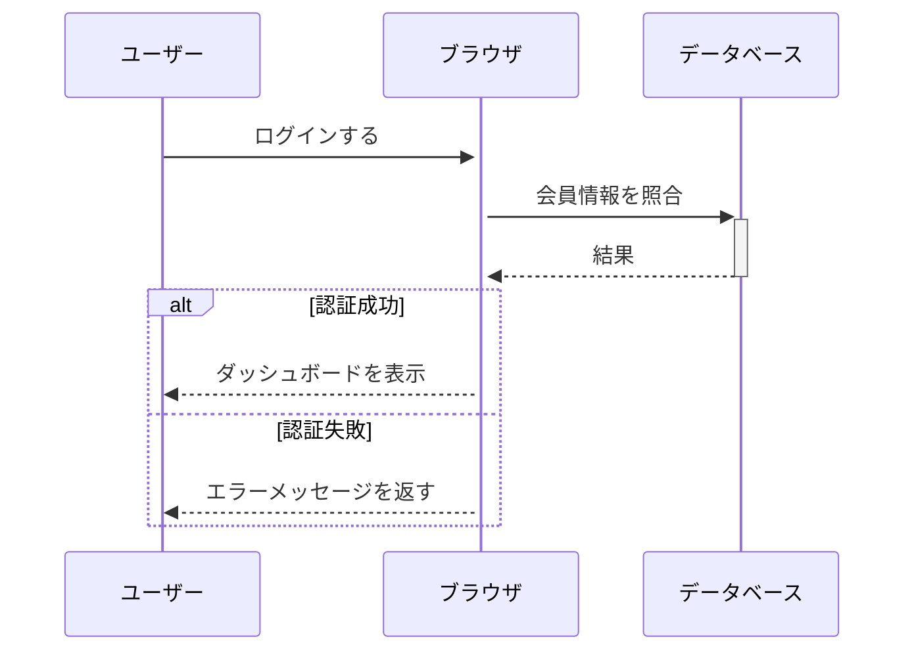
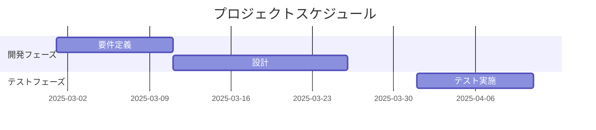

# タイトル

# 1. はじめに

1. aa
1. bbb
1. dddd


```html sample.html
hoge = hoge foo-bar
```

```python hoge.py
import requests

# コメント
def fetch_data(url: str) -> dict:
    res = requests.get(url)
    return res.json() if res.ok else {}

print(fetch_data("https://api.example.com/data"))
```

> aa
> hoge

> :::note
> Highlights information that users should take into account, even when skimming.
> aaaaaaaaaaa
> bbbbbbb

> :::note:warn
> Optional information to help a user be more successful.

> :::note:alert
> Optional information to help a user be more successful.








| x   | x   |
| --- | --- |
| x   | x   |

[https://zenn.dev/mizchi/articles/claude-code-orchestrator](https://zenn.dev/mizchi/articles/claude-code-orchestrator)

[https://qiita.com/papi_tokei/items/11877a857a60965a53fc](https://qiita.com/papi_tokei/items/11877a857a60965a53fc)

[https://www.skygroup.jp/tech-blog/article/1261/](https://www.skygroup.jp/tech-blog/article/1261/)

